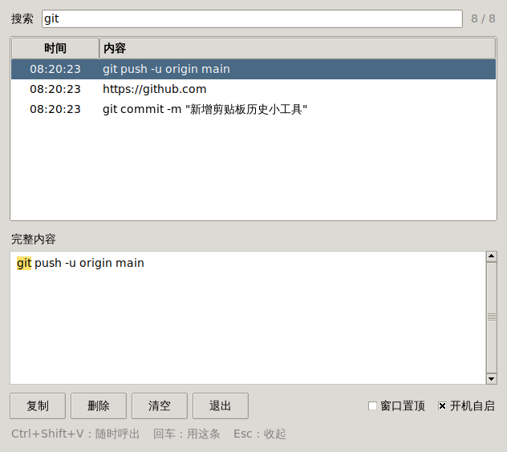

# 📋 剪贴板历史

一个轻巧的小工具：自动记下你最近复制的 **8 条**文字，第 9 条进来时最旧的那条会自动删掉。支持搜索，选中就能用。

在 Windows 上，它会一直在后台待命：**开机自动启动，关掉窗口也照样记录**。在任何地方按 **`Ctrl + Shift + V`** 就能把它叫出来，选好后**自动粘贴**。



## 功能

- **自动记录**：在任何程序里复制文字，都会出现在列表最上面
- **只留最近 8 条**：超过 8 条，最旧的自动删除
- **搜索**：边输入边过滤，不区分大小写；多个关键词用空格隔开，要全部包含才算匹配；预览里会把关键词标黄
- **随时呼出（Windows）**：在任何程序里按 `Ctrl + Shift + V`，窗口就弹出来；打字搜索、`↑` `↓` 挑选，按回车就自动粘贴到你刚才用的地方
- **关掉也照样记（Windows）**：点右上角的 × 只是藏到后台，照样记录，快捷键也照样能用；要彻底退出就点「退出」
- **开机自启（Windows）**：第一次运行后默认开启，以后一开机就在后台待命；不想要的话，取消勾选「开机自启」
- **不重复**：再次复制已有的内容，只会把它挪到最前面，不会多存一份
- **重启也不丢**：历史保存在 `~/.clipboard_history.json`，下次打开还在

## 怎么运行

只需要 Python 3.8 或更新的版本，不用装任何第三方库。

**Windows**：从 [python.org](https://www.python.org/downloads/) 安装 Python（安装时勾上 "Add python.exe to PATH"），然后**双击 `clipboard_history.py`** 就行。

只需要这一次！之后它会开机自动在后台运行，你只管按 `Ctrl + Shift + V`。

**macOS / Linux**：在终端里运行 `python3 clipboard_history.py`。macOS 用 Homebrew 装的 Python 需要先 `brew install python-tk`；Ubuntu / Debian 需要先 `sudo apt install python3-tk`。

## 快捷键

| 想做什么 | 按键 |
| --- | --- |
| 在任何地方呼出窗口（Windows） | `Ctrl + Shift + V`（再按一次收起） |
| 跳到搜索框 | `Ctrl + F`（macOS：`⌘ + F`） |
| 上下挑选 | `↑` / `↓` |
| 用选中的这条 | `回车` 或双击：用快捷键呼出时会自动粘贴回去，否则只复制到剪贴板 |
| 删除选中的记录 | `Delete`（先点一下列表） |
| 清空搜索 / 收起窗口 | `Esc`：搜索框有字时先清空，再按一次就收起（收起只在 Windows 上） |

预览区里也可以只选中一部分文字，再按 `Ctrl + C` 单独复制。

## 小提示

- 只记录文字，复制图片或文件会被忽略。
- 工具在运行才能记录。Windows 上它会自己在后台运行；macOS / Linux 上需要开着窗口（最小化没关系）。
- 已经在后台运行时再双击程序，不会开第二个，而是把正在运行的那个叫出来。
- `Ctrl + Shift + V` 会被本工具占用，有些软件里它原本是「粘贴为纯文本」。
- 如果自动粘贴没反应（比如对方是以管理员身份运行的程序），内容其实已经在剪贴板里了，手动按 `Ctrl + V` 就行。
- 打开工具之前就已经在剪贴板里的内容不会被记进来。
- 历史文件是明文保存的（只有你自己的账户能读）。如果复制过密码之类的敏感内容，记得在列表里把它删掉。

## 运行测试

```bash
python -m unittest -v
```

没有图形界面的环境（比如服务器）会自动跳过界面相关的测试；快捷键、开机自启、自动粘贴这些真的调用 Windows 的测试只在 Windows 上跑。每次往 GitHub 推送代码，都会自动在 Windows 和 Linux 上各跑一遍。
