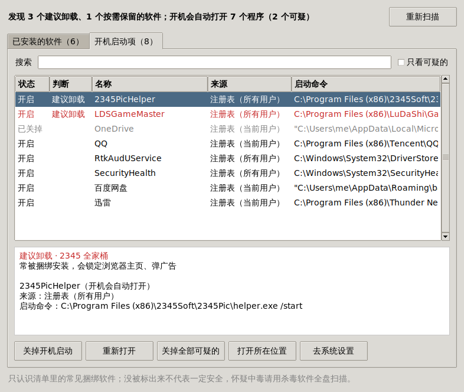
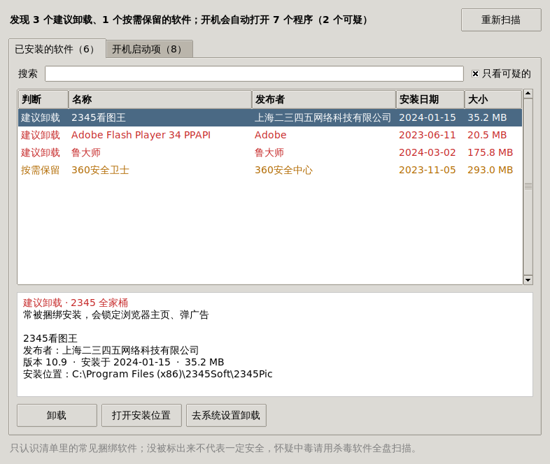

# 🧹 垃圾软件检查

一个 Windows 小工具：帮你找出电脑里常见的**捆绑软件、弹窗软件**，还有**早就停止更新的老软件**，告诉你为什么建议卸载。还能**一键关掉开机自动打开的程序**，**直接帮你卸载**。



## 怎么运行

只需要 Python 3.8 或更新的版本，不用装任何第三方库。

1. 在 GitHub Desktop 里点 **Fetch origin**，再点 **Pull origin**，拿到最新的文件
2. 点菜单 **Repository → Show in Explorer**，打开 `junk-software-checker` 文件夹
3. 双击 **`junk_checker.py`**
4. Windows 会弹出「你要允许此应用对你的设备进行更改吗？」，点 **是**

   这样之后关开机启动、卸载软件都不用再一个个授权。点「否」也能用，只是给所有用户设置的开机启动项改不了。
5. 工具会自动扫描，结果一下就出来了

## 关掉开机自动打开的程序

切到「**开机启动项**」标签页，这里列出了所有开机会自己打开的程序：

- 点一下选中（按住 `Ctrl` 可以多选），再点「**关掉开机启动**」，下次开机它们就不会自己跳出来了
- 「**关掉全部可疑的**」：把清单里的垃圾软件的开机启动一次性全关掉
- 关错了？选中后点「**重新打开**」就行

它改的就是任务管理器和系统设置里的那个开关：只关开关，不删东西，随时能改回来。

Windows 或驱动自带的启动项（比如声卡、安全中心）会特别提醒你，一般建议保留。

## 卸载软件

在「**已安装的软件**」标签页里选中一个，点「**卸载**」，确认一下就行：

- 能静默卸载的软件会**直接在后台卸掉**，不用你一路点下一步（大部分国产软件都支持）
- 不支持的会打开它自己的卸载窗口，按提示点下去就行，留意「再想想」「保留」之类的挽留按钮
- 卸载完成后列表会**自动刷新**



## 两种提醒

| 标记 | 意思 | 例子 |
| --- | --- | --- |
| **建议卸载**（红色） | 常被捆绑安装、弹广告、改浏览器主页，或者早就停止更新、留着有安全风险 | 2345 全家桶、鲁大师、驱动精灵、驱动人生、快压、Flash 中心、Flash Player、hao123、百度卫士 / 杀毒 / 浏览器、猎豹、小鸟壁纸、各种浏览器工具条、Silverlight、QuickTime…… |
| **按需保留**（橙色） | 本身没问题，但推广、弹窗比较多；电脑里留一个安全软件就够了 | 360 全家桶、腾讯电脑管家、金山毒霸、McAfee WebAdvisor |

完整清单在 `junk_checker.py` 开头的 `RULES` 里，每一条都写了理由。

## 小提示

- 有些软件会偷偷把自己的开机启动加回去，过几天再打开本工具看一眼就知道了。
- 从微软应用商店装的应用，开机启动要在「去系统设置」里关。
- 它只认识清单里的常见软件，**没被标出来不代表一定安全**。怀疑中毒的话，请用杀毒软件（比如 Windows 自带的 Microsoft Defender）全盘扫描。

## 自己加规则

在 `junk_checker.py` 的 `RULES` 里照着格式加一行：

```python
Rule(JUNK, "显示的名字", ("关键词1", "关键词2"), "为什么建议卸载"),
```

关键词会在软件名称、发布者和开机启动命令里查找，不分大小写。只是弹窗多、但有人需要的软件，把 `JUNK` 换成 `OPTIONAL`。

## 运行测试

```bash
python -m unittest -v
```

在 Windows 上还会真的去读写注册表：临时写入几条测试用的登记，测完马上删掉。
